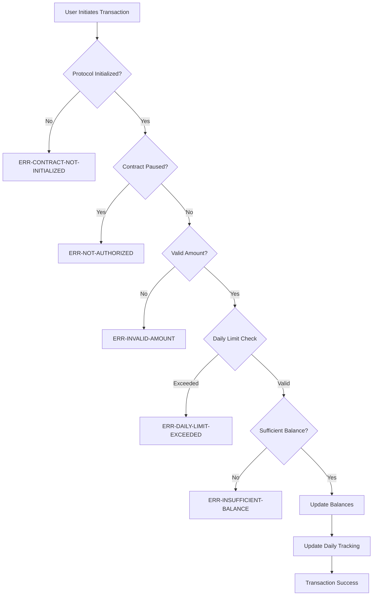
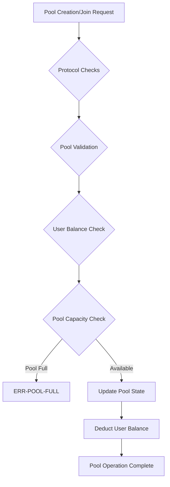

# BitGuard Treasury Protocol


## Overview

BitGuard Treasury Protocol is an enterprise-grade Bitcoin treasury management system built on Stacks Layer 2. Designed for institutional treasuries and high-net-worth individuals, this protocol delivers bank-grade security with decentralized transparency through cutting-edge smart contract architecture.

### Key Features

- 🏦 **Institutional-Grade Security**: Multi-layered security architecture with daily transaction limits
- 🔐 **Treasury Pool Management**: Privacy-enhanced collaborative treasury pools
- 📊 **Real-time Compliance**: Automated compliance monitoring and daily transaction tracking
- 🚨 **Emergency Controls**: Circuit breaker functionality for protocol suspension
- 💰 **Asset Management**: Secure deposit, withdrawal, and balance management
- 🛡️ **Risk Analytics**: Built-in risk management with configurable limits

## System Overview

The BitGuard Treasury Protocol operates as a sophisticated custody solution that bridges traditional finance requirements with Bitcoin's revolutionary potential. The system manages three core operational layers:

### 1. **Security Layer**

- **Daily Transaction Limits**: Maximum 100 BTC per user per day
- **Single Transaction Caps**: Up to 10,000 BTC per transaction
- **Emergency Controls**: Contract pause functionality for crisis management
- **Owner-based Access Control**: Restricted administrative functions

### 2. **Treasury Management Layer**

- **Individual Balances**: Personal treasury account management
- **Collaborative Pools**: Multi-participant treasury pools with privacy features
- **Minimum Thresholds**: Pool entry requirements for institutional participation
- **Participation Limits**: Maximum 10 participants per treasury pool

### 3. **Compliance Layer**

- **Transaction Monitoring**: Real-time tracking of daily transaction volumes
- **Automated Reporting**: Built-in compliance data for regulatory requirements
- **Protocol State Management**: Comprehensive system status monitoring

## Contract Architecture

### Core Components

```clarity
├── Constants & Configuration
│   ├── Error Codes (u1000-u1008)
│   ├── Transaction Limits (100-10,000 BTC)
│   └── Pool Parameters (10 max participants)
│
├── State Management
│   ├── Initialization Status
│   ├── Pause Controls
│   └── Fee Configuration (1% basis points)
│
├── Data Storage
│   ├── User Balances (principal → uint)
│   ├── Daily Transaction Tracking
│   └── Treasury Pool Management
│
└── Function Categories
    ├── Core Operations (deposit/withdraw)
    ├── Pool Management (create/join)
    ├── Emergency Controls (pause/unpause)
    └── Query Functions (read-only)
```

### Smart Contract Functions

#### **Public Functions**

| Function | Purpose | Access Level |
|----------|---------|--------------|
| `initialize()` | Protocol initialization | Contract Owner |
| `deposit(amount)` | Secure asset deposits | All Users |
| `withdraw(amount)` | Secure asset withdrawals | All Users |
| `create-mixer-pool(pool-id, amount)` | Create treasury pool | All Users |
| `join-mixer-pool(pool-id, amount)` | Join existing pool | All Users |
| `toggle-contract-pause()` | Emergency controls | Contract Owner |

#### **Read-Only Functions**

| Function | Returns | Description |
|----------|---------|-------------|
| `get-balance(user)` | `uint` | User account balance |
| `get-daily-limit-remaining(user)` | `uint` | Remaining daily transaction capacity |
| `get-contract-status()` | `{is-paused, is-initialized}` | Protocol operational status |

## Data Flow

### Transaction Processing Flow



### Pool Management Flow



## Security Model

### Multi-Layer Security Architecture

1. **Input Validation**
   - Amount range verification (0 < amount ≤ MAX_TRANSACTION_AMOUNT)
   - Protocol state validation (initialized, not paused)
   - User authorization checks

2. **Financial Controls**
   - Daily transaction limits per user (100 BTC)
   - Single transaction caps (10,000 BTC)
   - Balance sufficiency verification
   - Minimum pool entry thresholds

3. **Emergency Protocols**
   - Contract pause mechanism
   - Owner-only administrative controls
   - Graceful error handling with descriptive error codes

4. **State Management**
   - Atomic transaction processing
   - Consistent state updates
   - Daily transaction tracking reset

## Installation & Setup

### Prerequisites

- [Clarinet](https://github.com/hirosystems/clarinet) v2.0+
- [Node.js](https://nodejs.org/) v18+
- [Stacks CLI](https://docs.stacks.co/tools/cli)

### Development Environment

```bash
# Clone the repository
git clone https://github.com/uwana-bassey/bitguard-treasury.git
cd bitguard-treasury

# Install dependencies
npm install

# Run contract checks
clarinet check

# Run test suite
npm test

# Generate coverage report
npm run test:report

# Watch mode for development
npm run test:watch
```

### Contract Deployment

```bash
# Check contract syntax
clarinet check

# Deploy to local testnet
clarinet console

# Deploy to testnet/mainnet
clarinet deploy --network testnet
```

## Usage Examples

### Basic Operations

```clarity
;; Initialize the protocol (Owner only)
(contract-call? .bitguard-treasury initialize)

;; Deposit 1 BTC (100,000,000 satoshis)
(contract-call? .bitguard-treasury deposit u100000000)

;; Withdraw 0.5 BTC
(contract-call? .bitguard-treasury withdraw u50000000)

;; Check balance
(contract-call? .bitguard-treasury get-balance tx-sender)

;; Check daily limit remaining
(contract-call? .bitguard-treasury get-daily-limit-remaining tx-sender)
```

### Treasury Pool Operations

```clarity
;; Create a new treasury pool with 10 BTC
(contract-call? .bitguard-treasury create-mixer-pool u1 u1000000000)

;; Join existing pool with 5 BTC
(contract-call? .bitguard-treasury join-mixer-pool u1 u500000000)
```

### Emergency Controls

```clarity
;; Pause contract (Owner only)
(contract-call? .bitguard-treasury toggle-contract-pause)

;; Check contract status
(contract-call? .bitguard-treasury get-contract-status)
```

## Configuration Parameters

| Parameter | Value | Description |
|-----------|-------|-------------|
| `MAX-DAILY-LIMIT` | 100 BTC | Maximum daily transaction volume per user |
| `MAX-TRANSACTION-AMOUNT` | 10,000 BTC | Maximum single transaction amount |
| `MAX-POOL-PARTICIPANTS` | 10 | Maximum participants per treasury pool |
| `MIN-POOL-AMOUNT` | 0.001 BTC | Minimum amount to join/create pools |
| `MIXING-FEE` | 1% | Protocol fee in basis points |

## Error Codes

| Code | Error | Description |
|------|-------|-------------|
| u1000 | `ERR-NOT-AUTHORIZED` | Insufficient permissions |
| u1001 | `ERR-INVALID-AMOUNT` | Invalid transaction amount |
| u1002 | `ERR-INSUFFICIENT-BALANCE` | Insufficient user balance |
| u1003 | `ERR-CONTRACT-NOT-INITIALIZED` | Protocol not initialized |
| u1004 | `ERR-ALREADY-INITIALIZED` | Protocol already initialized |
| u1005 | `ERR-POOL-FULL` | Treasury pool at capacity |
| u1006 | `ERR-DAILY-LIMIT-EXCEEDED` | Daily transaction limit exceeded |
| u1007 | `ERR-INVALID-POOL` | Invalid pool ID or state |
| u1008 | `ERR-DUPLICATE-PARTICIPANT` | User already in pool |

## Testing

The protocol includes comprehensive test coverage using Vitest and Clarinet SDK:

```bash
# Run all tests
npm test

# Run tests with coverage
npm run test:report

# Development mode with file watching
npm run test:watch
```

### Test Categories

- ✅ Protocol initialization and state management
- ✅ Deposit and withdrawal operations
- ✅ Daily limit enforcement
- ✅ Treasury pool creation and management
- ✅ Emergency controls and circuit breakers
- ✅ Error handling and edge cases

## Contributing

1. Fork the repository
2. Create a feature branch (`git checkout -b feature/amazing-feature`)
3. Commit your changes (`git commit -m 'Add amazing feature'`)
4. Push to the branch (`git push origin feature/amazing-feature`)
5. Open a Pull Request

### Development Guidelines

- Follow Clarity best practices
- Maintain comprehensive test coverage
- Update documentation for new features
- Ensure all tests pass before submitting PRs

## Security Considerations

- **Audit Status**: Contract pending professional security audit
- **Bug Bounty**: Security researchers welcome to report vulnerabilities
- **Emergency Contacts**: Contact maintainers for critical security issues
- **Upgrade Path**: Protocol designed for future upgrades with migration strategies

## License

This project is licensed under the ISC License - see the [LICENSE](LICENSE) file for details.

## Roadmap

### Phase 1 (Current)

- ✅ Core treasury management functions
- ✅ Basic security controls
- ✅ Treasury pool system

### Phase 2

- 🔄 Multi-signature governance
- 🔄 Advanced compliance reporting
- 🔄 Integration APIs

### Phase 3

- 📋 Institutional custody features
- 📋 Cross-chain compatibility
- 📋 Advanced analytics dashboard
